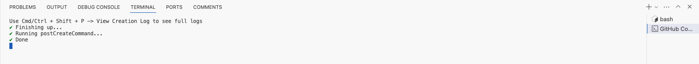
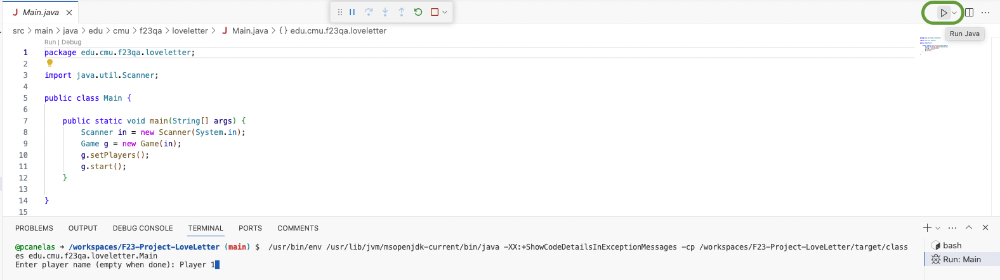
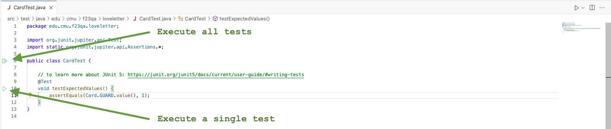
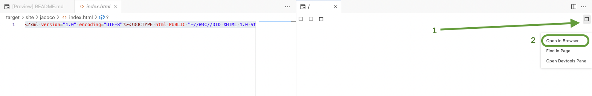

# Love Letter

This repository provides a partial implementation of the popular board game, Love Letter.

## Installation

### GitHub Codespaces

Since the game is played via a command-line interface, GitHub Codespaces is the easiest way to work with this project.
To get up and running:

1. In the current repository, go to `<> Code > Codespaces > Create codespace on main`.
2. Wait until the container finishes building.
3. After the Codespaces open, wait until you receive the message that the setup is Done and the terminal closes.
4. After the setup is done, **close the Terminal and open a new window to use any of the pre-installed tools**.



### Local Setup

This project uses the following languages, tools, and frameworks:

* Java 17
* Maven
* [JUnit 5](https://junit.org/junit5)
* [PITest](https://pitest.org) (pitest-junit5-plugin)
* [Mockito](https://site.mockito.org) (v5.6.0)
* [EasyMock](https://easymock.org) (v5.2.0)
* [Jacoco](https://www.eclemma.org/jacoco/trunk/index.html) (v0.8.11)

## How to run

In Visual Studio Code (VS Code), open the `Main.java` file and press the run button in the top right corner.
The application will launch and you can interact with it through the command-line.


## How to test

### Running the tests

Select the class you intend to test and press the run botton next to the class.
Optionally, if you want to execute a single test, you can press the run button next to the test case in the class.


You can also run all tests by running the following command in the command-line.

```shell
mvn clean compile test
```

### Checking JaCoCo Output

Executing the `mvn clean compile test` will create the JaCoCo report. You can access the report in the `target/site/jacoco/index.html` folder.
In GitHub Codespaces, you can open the report by opening the `index.html` and clicking the Preview icon in the top right ().

If it does not work, press the white square for more browser options (1), select `Open in browser` (2), and press `Open`, when the confirmation window pops-up.



### Running Pitest

To execute pitest, execute the following command in the command-line. The command will generate an html report to `target/pit-reports/YYYMMDDHHMI`. You can access these html reports similarly to the procedure described for checking the JaCoCo output.

```shell
mvn test-compile org.pitest:pitest-maven:mutationCoverage
```

### Running CK for complexity metrics

Once you have installed the standalone Maven packages in the `deps` directory, you can run CK on this project by executing the following from the root of repository:

```shell
mvn com.github.jazzmuesli:ck-mvn-plugin:metrics
```

Running the above command will generate a `class.csv`, `field.csv`, `method.csv`, and `variable.csv` file for every directory that contains source code.
To find metrics for the project source code itself, simply look at the CSV files that are emitted within `src/main/java`.

You can find a definition of each of the metrics reported in the CSV files in the README of the CK repository: https://github.com/mauricioaniche/ck
